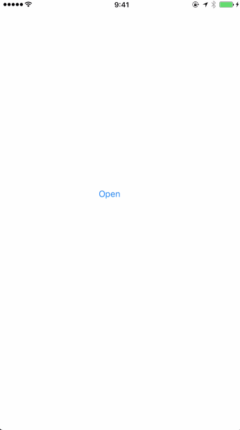

# PlainMenuController

[](https://travis-ci.org/keisei_1092/PlainMenuController)
[](http://cocoapods.org/pods/PlainMenuController)
[](http://cocoapods.org/pods/PlainMenuController)
[](http://cocoapods.org/pods/PlainMenuController)

Basic, and essential slide menu library developed with Swift 3.0.



## Example

To run the example project, clone the repo, and run `pod install` from the Example directory first.

## Usage

* Add `import PlainMenuController` in your ViewController which you want to call
* In a particular event handler in your ViewController, add codes below

```swift
let storyboard = UIStoryboard.init(name: MENU_VIEW_CONTROLLER, bundle: nil)
let menuViewController = storyboard.instantiateInitialViewController() as! MenuViewControllerClass
let navigationController = UINavigationController(rootViewController: menuViewController)
navigationController.modalPresentationStyle = .custom
navigationController.transitioningDelegate = self
self.present(navigationController, animated: true, completion: nil)
```

* In bottom of your ViewController, add codes below

```swift
extension ViewController: UIViewControllerTransitioningDelegate {

    func presentationController(forPresented presented: UIViewController, presenting: UIViewController?, source: UIViewController) -> UIPresentationController? {
        return MenuPresentationController(presentedViewController: presented, presenting: presenting)
    }

    func animationController(forPresented presented: UIViewController,
                             presenting: UIViewController,
                             source: UIViewController) -> UIViewControllerAnimatedTransitioning? {
        return MenuPresentationAnimator(isPresentation: true)
    }

    func animationController(forDismissed dismissed: UIViewController)
        -> UIViewControllerAnimatedTransitioning? {
            return MenuPresentationAnimator(isPresentation: false)
    }

}
```

## Installation

PlainMenuController is available through [CocoaPods](http://cocoapods.org). To install
it, simply add the following line to your Podfile:

```ruby
pod "PlainMenuController"
```

## Author

keisei_1092, keisei_1092@yahoo.co.jp

## License

PlainMenuController is available under the MIT license. See the LICENSE file for more info.
